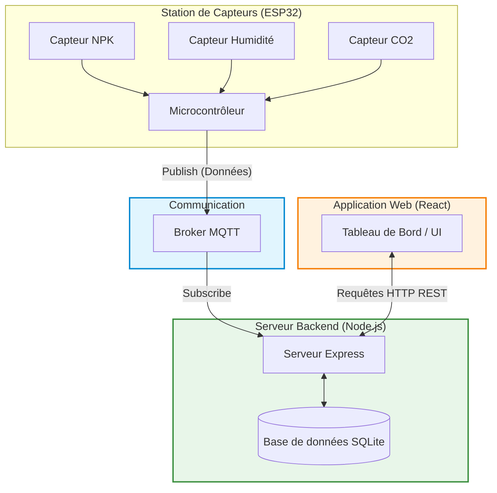

# AgriShare 🌾

AgriShare est une plateforme numérique collaborative destinée à la communauté agricole, intégrant des aspects sociaux, de gestion de données et d'intelligence artificielle. Ce dépôt englobe le module matériel (IoT) et logiciel permettant l'acquisition de données environnementales en temps réel, leur transmission via MQTT et leur visualisation sur un tableau de bord moderne.

> **Note :** Ce projet a été conçu et développé dans le cadre d'un stage d'été au sein de l'entreprise **Avicenne Consulting**.

---

## 📖 Présentation du projet

### Le problème résolu
L'agriculture moderne est confrontée à des défis majeurs, notamment la gestion optimale des ressources naturelles (terre, eau) face aux aléas climatiques. Pour améliorer la rentabilité et garantir la durabilité, il est indispensable de disposer de données précises sur l'état des parcelles agricoles afin de prendre des décisions éclairées.

### Les objectifs
L'objectif principal est de concevoir et réaliser une **station de capteurs connectée et intelligente**. Elle vise à mesurer en temps réel divers paramètres environnementaux (humidité du sol, nutriments NPK, CO2, etc.) et à transmettre ces données de manière fiable vers le Cloud afin d'alimenter la plateforme AgriShare.

### Les fonctionnalités principales
- **Acquisition en temps réel** : Lecture de multiples capteurs IoT simulés (CO2, Humidité, NPK).
- **Transmission sécurisée et légère** : Envoi des relevés télémétriques vers un broker via le protocole MQTT.
- **Stockage et API** : Backend robuste enregistrant les historiques dans une base de données relationnelle et les rendant accessibles via une API REST sécurisée.
- **Tableau de bord (Dashboard)** : Interface utilisateur moderne et réactive permettant la visualisation des données sous forme de graphiques en temps réel.
- **Intelligence Artificielle** : Intégration d'algorithmes d'IA pour analyser les données environnementales et optimiser les prises de décision agricoles.

### Les technologies utilisées
- **IoT & Firmware** : C/C++ (Environnement Arduino/ESP32), Simulateur Wokwi.
- **Backend** : Node.js, Express.js, SQLite, JsonWebToken, MQTT (mqtt.js).
- **Frontend** : React.js, Vite, Tailwind CSS, Recharts, Lucide React.

---

## 📸 Aperçu de l'Interface

**1. Page de Connexion & Inscription**
<p align="center">
  
  
</p>

**2. Tableau de Bord (Dashboard)**
*Visualisation en temps réel des données des capteurs (climat, humidité, luminosité, CO2).*
<p align="center">
  
  <br>
  
</p>

**3. Intelligence Artificielle & Communauté**
*Retours des agriculteurs voisins et diagnostics agronomiques générés par l'IA.*
<p align="center">
  
  <br>
  
</p>

---

## 🏗 Architecture générale

Voici le schéma d'architecture représentant le flux de données de bout en bout, de l'acquisition matérielle à la visualisation côté client :



---

## 📂 Structure du projet

Le code source est divisé en trois composants principaux, reflétant l'architecture décrite ci-dessus.

```text
AgriShare/
├── Agrishare-firmware/         # Code source du microcontrôleur et simulation IoT
│   ├── sketch.ino              # Script principal (C/C++) du microcontrôleur
│   ├── co2sensor.chip.c        # Implémentation du capteur de CO2 personnalisé
│   ├── moisture-sensor.chip.c  # Implémentation du capteur d'humidité du sol
│   ├── npksensor.chip.c        # Implémentation du capteur de nutriments NPK
│   └── diagram.json            # Configuration du circuit (Wokwi)
│
├── agrishare-backend/          # API REST et gestion de la base de données
│   ├── server.js               # Point d'entrée de l'API et client MQTT
│   ├── database.js             # Configuration et modèles SQLite
│   ├── database.sqlite         # Fichier de base de données locale
│   └── package.json            # Dépendances Node.js (Express, bcrypt, jwt...)
│
├── agrishare-ui/               # Interface utilisateur (Dashboard React)
│   ├── src/                    # Code source des composants React (Vite)
│   ├── public/                 # Ressources statiques
│   ├── package.json            # Dépendances frontend (React, Tailwind, Recharts)
│   └── vite.config.js          # Configuration du bundler Vite
│
└── rapport_agrishare.tex       # Rapport de stage détaillé au format LaTeX
```

---

## 🚀 Comment exécuter le projet localement

### 1. Démarrer le Backend
Le backend gère la base de données SQLite, l'API REST et écoute les messages MQTT.

```bash
cd agrishare-backend
npm install
npm run dev
```

### 2. Démarrer le Frontend (UI)
L'interface utilisateur React qui affiche le tableau de bord de la station de capteurs.

Dans un **nouveau terminal** :
```bash
cd agrishare-ui
npm install
npm run dev
```

### 3. Lancer la simulation IoT (Firmware)
Le firmware peut être simulé en utilisant Wokwi (ou flashé sur un vrai ESP32/Arduino). Les fichiers `.chip.c` et `diagram.json` définissent l'environnement matériel virtuel.

> **Lien de la simulation interactive :** [Voir le projet Wokwi (Simulation)](https://wokwi.com/projects/467797481012494337)

